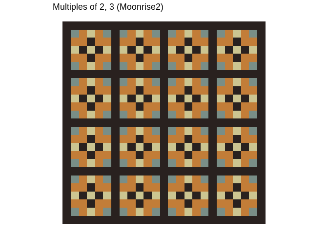

multable
========

Overview
--------

multable provides some functions to visualize the patterns that emerge when we color factors of some specified values.

Installation
------------

``` r
# install.packages("devtools")
devtools::install_github("solmos/multable")
```

Examples
--------

``` r
library(multable)
draw_pattern(k = c(2, 3))
```


